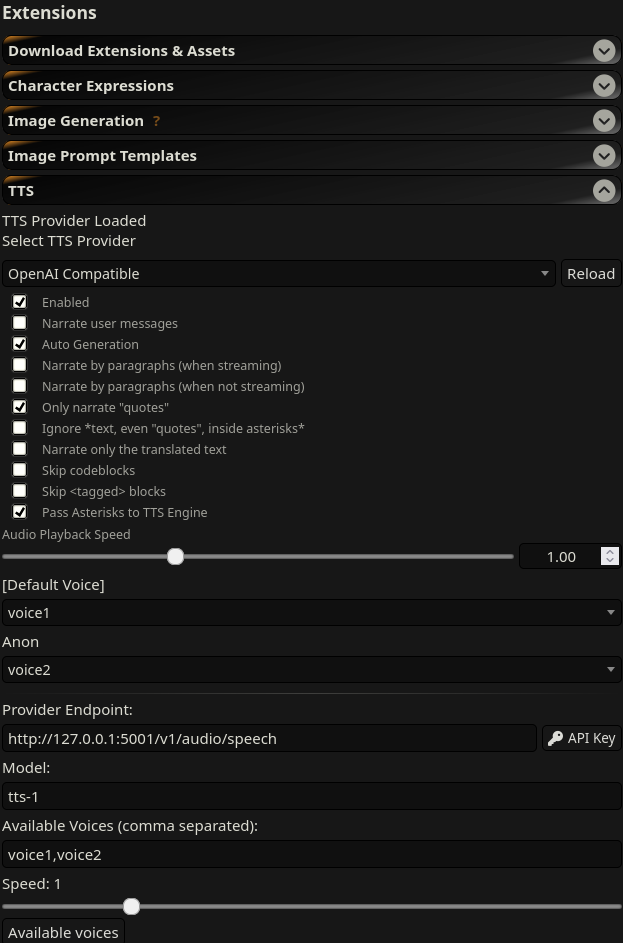

# SillyTavern

As it exposes an OpenAI compatible API, this program can be used as a SillyTavern TTS endpoint.

Select TTS Provider: `OpenAI Compatible`

Provider Endpoint: `http://127.0.0.1:5001/v1/audio/speech` (default value, change as needed)

Available Voices (comma separated): `voice1,voice2` (set voices from your server's `supported_voices`)

Model and API key settings are ignored.

